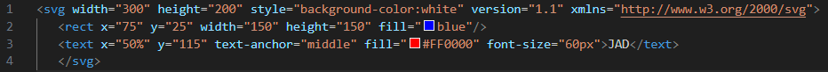

# CBC Week 10 Challenge: Logo Generator
## Description

This project is the eighth from the UC Berkeley Coding Boot Camp.  The goal of the project is to create a command line application that generates a logo based on user input.  The application uses the [Inquirer](https://www.npmjs.com/package/inquirer) package to prompt the user for information.  The application then uses the information to generate an SVG file that can be opened in a browser.  The application also uses the [Jest](https://jestjs.io/) testing framework to test the application.  The application is written in JavaScript and uses the [Node.js](https://nodejs.org/en/) runtime.  The parameters that can be edited for the logo are the following:

- Shape Background
- Shape Color
- Text
- Text Color

The shapes classes are extended from a common base class.  Each shape class is responsible for generating the SVG code for the shape.  The text class is responsible for generating the SVG code for the text.  The application is written in a modular fashion to allow for easy expansion.

To validate answers, the application uses the [css-color-names](https://www.npmjs.com/package/css-color-names) package to check if the color name is valid.  It can also check if the color is a valid hex color.  If neither is provided, the application will provide links to the color names and hex color codes.

## Final Product

The final product can be downloaded at https://github.com/JDempe/bootcamp-10-logo-generator.

### Prerequisites

To run the application, you will need to have the following installed on your machine:
1. [Node.js](https://nodejs.org/en/)

### User Interface

The application uses the command line interface (CLI) to prompt the user for information.  The user will be asked a series of questions about the style and content of the desired logo.

### Usage Instructions

To use the application, follow these steps:

1. Clone the repository to your local machine.
2. Open the repository in your preferred code editor.
3. From the root folder, run the command 'npm install' in your terminal to install dependencies.
4. (Optional) From the root folder, run the command 'npm test' in your terminal to run the tests.
5. From the root folder, run the command 'npm start' in your terminal to start the application.
6. Answer the questions as prompted.  Each question has validation's to ensure the user provides the correct information.

The output will be a file called 'logo.svg' in the root folder of the project.  The file can be opened in any browser to render.  Be careful, running the application again will overwrite this file!

Below is a video of the application being used.

<video src="" controls="controls" style="max-width: 720px;"></video>

And this is the output from the above video.

<kbd> </kbd>

<kbd> </kbd>

## Credits

### Resources

The below resources contributed to the project.

- [Node.js](https://nodejs.org/en/) is a JavaScript runtime built on Chrome's V8 JavaScript engine.  The file system module is used to read and write files.

- [Inquirer](https://www.npmjs.com/package/inquirer) is a collection of common interactive command line user interfaces.

- [Jest](https://jestjs.io/) is a JavaScript testing framework.

- [css-color-names](https://www.npmjs.com/package/css-color-names) is a package that provides a list of CSS color names created by [Bahamas10](https://github.com/bahamas10/css-color-names)
  
- [StackOverflow](https://stackoverflow.com/) provided many answers to my questions.
  - [Checking for Valid Hex Color](https://stackoverflow.com/questions/8027423/how-to-check-if-a-string-is-a-valid-hex-color-representation)

- [GeeksforGeeks](https://www.geeksforgeeks.org/how-to-set-the-svg-background-color/) provided the code to change the SVG background color.

### Collaborators

On this project, there was no peer review or collaboration.

## License

Refer to the LICENSE in the repository.

## How to Contribute

Contribute at https://github.com/JDempe/bootcamp-10-logo-generator.
